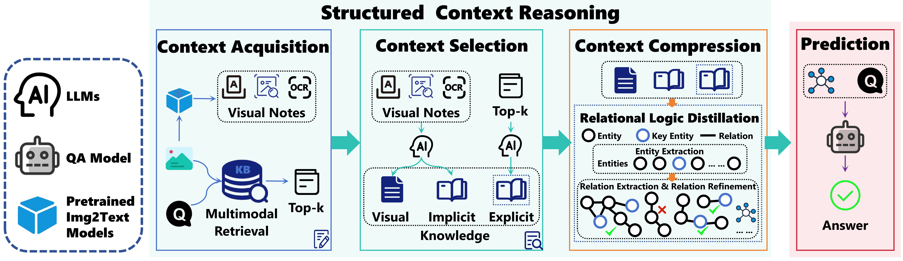
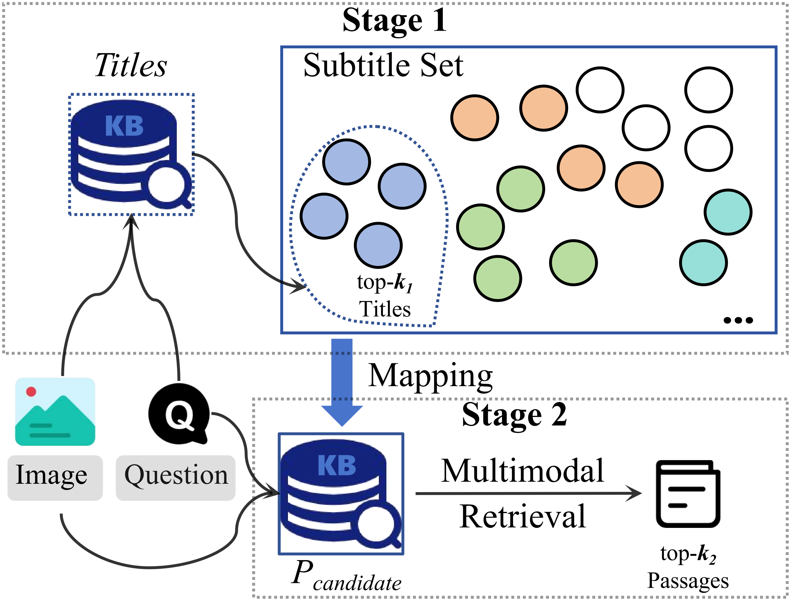

# Boosting Knowledge-based Visual Question Answering with Structured Context Reasoning

*ICME 2026*

## Abstract

Knowledge-based Visual Question Answering aims to answer questions about an image by integrating external knowledge with visual and textual information. Recent approaches often rely on in-context learning to prompt Large Language Models (LLMs) with multimodal context in a zero-shot or few-shot manner. However, we observe that directly concatenating heterogeneous visual descriptions and retrieved knowledge into long, unstructured prompts often degrades reasoning performance, due to both excessive irrelevant context and the lack of explicit relational structure. In this paper, we propose an LLM-based Structured Context Reasoning (SCoRe) framework that infers both explicit and implicit relationships for prediction. SCoRe consists of three stages: Context Acquisition, which generates diverse visual notes and retrieves explicit knowledge via an efficient two-stage multimodal retrieval strategy; Context Selection, which filters relevant visual, explicit, and implicit knowledge using LLM-guided selection; and Context Compression, which performs Relational Logic Distillation (RLD) to transform raw text into explicit entity-relation triplets. These relational triplets serve as a concise and structured prompt for final answer prediction. Extensive experiments on the OK-VQA and A-OKVQA benchmarks demonstrate that SCoRe consistently outperforms state-of-the-art methods.

## Architecture



### Stage 1: Context Acquisition

The Context Acquisition stage aims to construct a comprehensive but decomposed evidence pool from both visual inputs and external knowledge sources.

**Visual Evidence:** Three parallel views are used to preserve complementary visual cues:
- **Object Attributes** - Extracted using [VinVL](https://github.com/pzzhang/VinVL)
- **Image Captions** - Generated via question-guided captioning ([PNP-VQA](https://github.com/anthonytmh/lavis-pnpvqa))
- **OCR Text** - Extracted from image text using Google Cloud Vision API

**Explicit Knowledge Retrieval:** A two-stage progressive multimodal retrieval strategy based on [PreFLMR](https://github.com/linweizhedragon/FLMR#new-use-preflmr) for Wikipedia:
- **First Stage: Title-level multimodal coarse retrieval**
- **Second Stage: Paragraph-level multimodal fine-grained retrieval**



### Stage 2: Context Selection

The Context Selection stage focuses on reducing evidence redundancy while preserving question-relevant semantics. LLMs are utilized to select visual knowledge, explicit knowledge, and extract implicit knowledge.

> All prompts for Stage 2 are in `prompts.py`.

### Stage 3: Context Compression

The Context Compression stage performs Relational Logic Distillation (RLD) to transform raw text into explicit entity-relation triplets. 

> All prompts for Stage 3 are in `prompts.py`.

### Prediction

The Prediction stage uses the structured relation triplets $R_i$ for answer prediction.

**Zero-shot:** Following [Img2LLM](https://github.com/salesforce/LAVIS/tree/main/projects/img2llm-vqa), QA pairs are generated from image captions as demonstrations.

**Few-shot:** Top-n training samples are selected as exemplars based on average cosine similarity between CLIP-based image and question embeddings.

## Quick Start

### Environment

```bash
pip install torch transformers nltk inflect numpy pillow tqdm
```

### Data Preparation

Download COCO images and organize as:
```
assets/okvqa/
├── test/
│   ├── annotations/
│   ├── questions/
│   ├── image/val2014/
│   └── relation/triple_rel_ok.json
└── train/
    ├── annotations/
    ├── questions/
    ├── image/train2014/
    └── relation/triple_rel_ok.json
```

### Run

**Zero-shot:**
```bash
python zero_shot.py
```

**Few-shot:**
```bash
python few_shot.py
```

## File Structure

```
SCoRe-code/
├── assets/okvqa/
│   ├── test/
│   │   ├── annotations/
│   │   ├── questions/
│   │   ├── image/val2014/     # COCO val images
│   │   ├── relation/
│   │   │   └── triple_rel_ok.json
│   │   └── ...
│   └── train/
│       ├── annotations/
│       ├── questions/
│       ├── image/train2014/    # COCO train images
│       └── relation/
│           └── triple_rel_ok.json
├── my_dataset/
│   └── okvqa_datasets.py      # OK-VQA dataset loader
├── prompts.py                  # Prompts for Stage 2 & 3
├── few_shot.py                 # Few-shot prediction
└── zero_shot.py                # Zero-shot prediction
```

## Citation

If you use this code, please cite our paper:

```bibtex
@inproceedings{score2026,
  title={Boosting Knowledge-based Visual Question Answering with Structured Context Reasoning},
  author={Liu, Qiyou and Zhang, Yong and Luo, Jianjie and Yang, Zhenguo and Yu, Yi},
  booktitle={ICME},
  year={2026}
}
```
